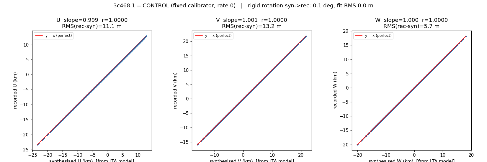
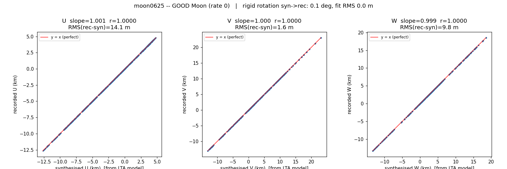
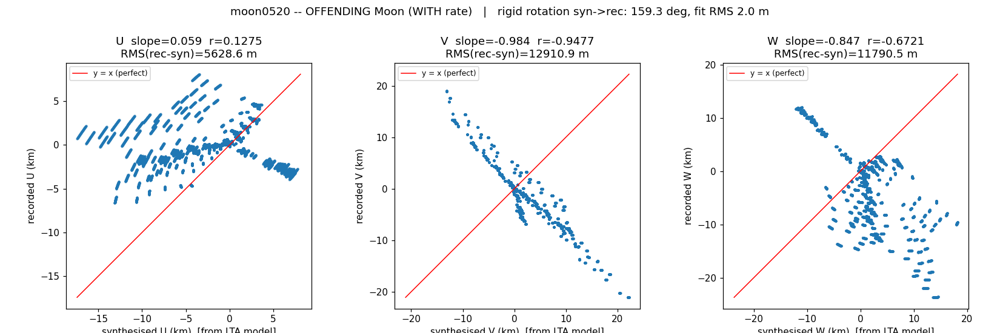
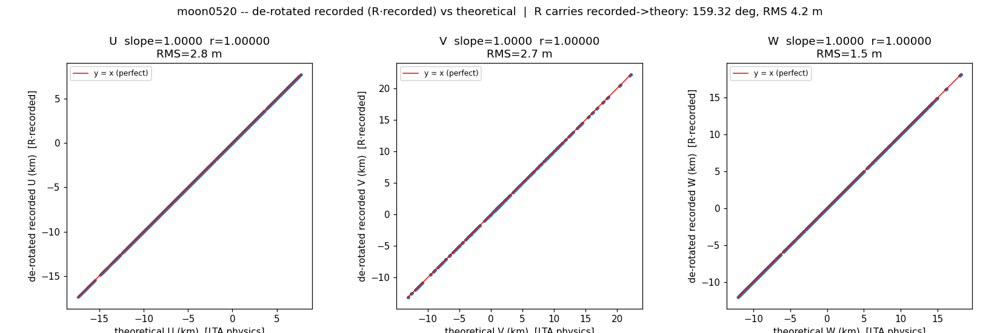
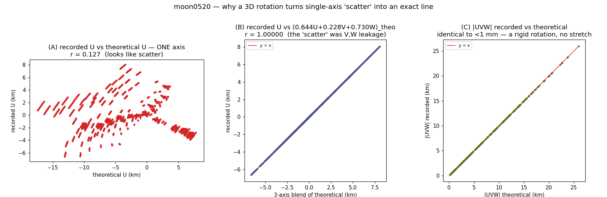
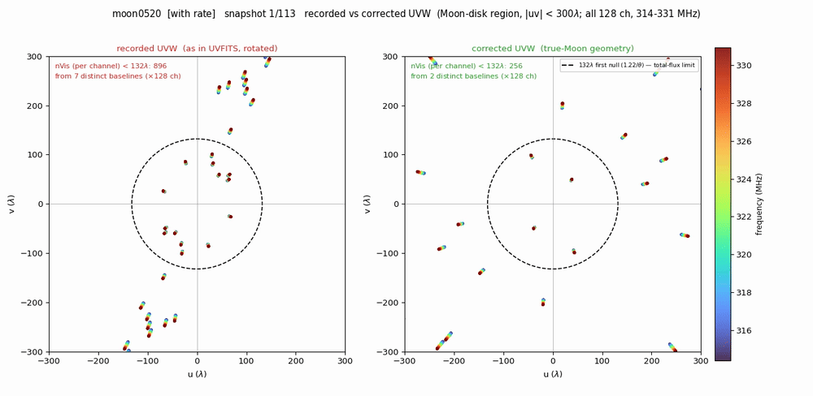

# Moon UVW / Fringe-Stopping Consistency Investigation

*The investigation is done by inspection of the real UVFITS/MS files under
`~/DATA/gmrt_40_014/`, the GSB LTA file (`data/40_014_25jul2021_gsb.lta` — the GMRT
Software Backend "Long Term Accumulation" correlator-output file, whose per-scan
header blocks record the source coordinates and tracking rates the online correlator
was handed), and independent recomputation of the geometry. Last updated 2026-10-02.*

---

## 1. Problem statement

Project GTAC 40_014 (Band-3, night of 2021-07-25/26) observed several sources,
among them the Moon in five scans and the fixed calibrator 3C468.1 (used here as a
consistency control). The problem investigated here appears only in some of the
Moon scans. To check whether the recorded `UVW` are consistent with the sky
direction each scan should be fringe-stopped on, we recompute the `UVW`
independently from geometry (the "theoretical" `UVW`, method in §3) and plot them,
axis by axis, against the values recorded in the UVFITS. A scan whose recorded
`UVW` are consistent gives a straight `y = x` line on all three of the U, V and W
panels.

Three cases show the pattern (x = theoretical, y = recorded):

**Calibrator 3C468.1** — consistent (`y = x` on U, V, W):



**A Moon scan, moon0625** — consistent (`y = x` on U, V, W):



**A Moon scan, moon0520** — *not* consistent. U shows no correlation (r = 0.13),
V lies on a clean straight line of the wrong slope (r = −0.95), and W is correlated
but scattered (r = −0.67):



Across all six pointings the split is clean: the calibrator and two Moon scans are
consistent; three Moon scans are not. Inverting the geometry from the recorded `UVW`
of the three inconsistent scans, they point **126–141° away** from the Moon — at
RA 101°, 107° and 121° (the "implied direction" column below), rather than at the
Moon's RA ≈ 331°. Those RA 101–121° directions are what the recorded `UVW` encode;
they were never *commanded* (§3.2 shows the correlator was given RA ≈ 331° for all
five scans).

| Pointing | UTC (centre) | Moon elev | recorded-UVW implied direction (RA, Dec) | separation from apparent Moon |
|----------|--------------|----------:|------------------------------------------|------------------------------:|
| 3C468.1  | (bracketing) |     —     | catalogue position                       | **0.06°** (consistent) |
| moon0520 | 00:02:47     | 30.9°     | 101.34, −5.48                            | **125.65°** |
| moon0545 | 00:23:36     | 26.9°     | 107.47, −4.77                            | **131.32°** |
| moon0605 | 00:45:08     | 22.7°     | 121.23, −7.39                            | **141.22°** |
| moon0625 | 01:01:19     | 19.5°     | 331.81, −17.12                           | **0.09°** (consistent) |
| moon0635 | 01:07:49     | 18.1°     | 331.88, −17.08                           | **0.11°** (consistent) |

At this stage we make no assumption about *why* three scans differ. The rest of the
document establishes the cause and whether the affected data can still be imaged.

---

## 2. Background — how the Moon was tracked

The observation notes for this run record that the Moon was tracked in two
different ways, and that this was an unusual, rarely-used mode:

- **With a scan rate.** The telescope is given the Moon's apparent RA/Dec *and its
  rate of change* (`dRA/dt`, `dDec/dt`). The rate lets the pointing follow the
  Moon's motion across the sky during the scan, so the dishes stay on the Moon's
  face for the whole scan.
- **Without a rate (fixed RA/Dec).** The telescope is parked at a constant RA/Dec
  chosen close to the Moon and held there. Over the scan the Moon drifts through
  that fixed pointing (≈0.5°/hr), so it is not perfectly centred throughout, but
  stays within the beam for a short scan.

The five scans split accordingly: **moon0520 / moon0545 / moon0605** are the three
15-min **with-rate** scans; **moon0625 / moon0635** are the two 5-min **no-rate**
scans. Mapping this onto §1: the three inconsistent scans are exactly the with-rate
scans, and the two consistent Moon scans are the no-rate scans.

---

## 3. Investigating the nature of the discrepancy

### 3.1 The usual suspects

Before measuring, the candidate causes for `UVW` pointing 126° off the Moon are:

1. A **wrong position** was commanded to the correlator.
2. A **wrong rate value** was commanded.
3. A **units error** in the rate (radians vs degrees).
4. A **time / clock error** (wrong hour angle → wrong `UVW`).
5. A **rate × time drift** (the phase centre walking away along the Moon's motion).
6. An **axis swap / scale error** in the recorded `UVW`.
7. A **fixed repointing** to a wrong location on the sky.

### 3.2 The metadata ambiguity, and how it was resolved

The UVFITS metadata is ambiguous on its own: it carries the source position in
*two* coordinate systems — `SU RAEPO/DECEPO` (J2000) and `SU RAAPP/DECAPP`
(apparent of date) — and *several* time anchors that disagree (`MJD_SRC`,
`MJD_REF`, `DATE-OBS`), some off by about a day. Deriving the theoretical `UVW`
from the file's own `SU` apparent position would also be circular: those are
values gvfits wrote into the file, not necessarily what it used to compute the
`UVW`.

The unambiguous source is the **GSB LTA online model**
(`~/DATA/gmrt_40_014/data/40_014_25jul2021_gsb.lta`) — the model actually handed to
the correlator. It stores a per-scan source block (`OBJECT`, `RA-DATE`/`DEC-DATE`
in apparent degrees, and `DRA/DT`/`DDEC/DT` rates). For the five Moon scans
(SCAN0026–0030):

| scan | OBJECT | RA-DATE | DEC-DATE | DRA/DT (deg/s) | DDEC/DT (deg/s) |
|------|--------|--------:|---------:|---------------:|----------------:|
| 0026 | MOON0520 | 331.218408 | −17.384986 | 0.000103 | 0.000067 |
| 0027 | MOON0545 | 331.383452 | −17.283068 | 0.000108 | 0.000069 |
| 0028 | MOON0605 | 331.521323 | −17.200152 | 0.000112 | 0.000070 |
| 0029 | MOON0625 | 331.664774 | −17.116175 | **0.000000** | **0.000000** |
| 0030 | MOON0635 | 331.738688 | −17.073822 | **0.000000** | **0.000000** |

Two facts follow directly from this table: the commanded position is the correct
apparent Moon for all five scans (matching the UVFITS `SU RAAPP/DECAPP` to
<0.001°; nothing near 101–121° was ever commanded), and the with-rate / no-rate
split is exactly the offending / consistent split.

**Inputs used for the theoretical `UVW`.** The phase centre comes from the LTA
`RA-DATE`/`DEC-DATE` plus the LTA rate propagated over the scan; from the UVFITS we
keep only the antenna geometry (`AIPS AN` `STABXYZ`) and the per-integration UTC
(`DATE`, used for GAST). The file's `SU RAAPP/DECAPP` is *not* used (it matches the
truth to <0.09°, confirming the file metadata is internally correct, but it is not
an input). The forward model, with site longitude 74.056°E, is

```
H = LAST − RA,   LAST = GAST + longitude
u =  sin H·Bx + cos H·By
v = −sin d cos H·Bx + sin d sin H·By + cos d·Bz
w =  cos d cos H·Bx − cos d sin H·By + sin d·Bz
```

with `(Bx,By,Bz)` the `STABXYZ` differences and baseline sign `ant2 − ant1`. The
same code recovers the calibrator 3C468.1 to 0.06° and moon0625/0635 to 0.09°/0.11°
of the apparent Moon (the equivalent W-residuals are 3 m and 27–29 m — over the
~26 km array a 0.1° pointing error projects to tens of metres of baseline, so these
metre-level residuals *are* the arcminute-level pointing agreement).

### 3.3 Strategy and result

The strategy is the axis-by-axis comparison of §1: recorded vs theoretical `UVW`.
The consistent scans give `y = x` on all three axes. The with-rate scans do not:
for moon0520 the U panel is an uncorrelated cloud (r = 0.13), the V panel is a clean
straight line of the wrong (near −1) slope (r = −0.95), and the W panel is correlated
but scattered (r = −0.67). That mix — one clean anti-diagonal, one cloud, one partial
— is not noise or a per-axis scale error: it is the fingerprint of each recorded axis
being a *fixed blend of all three* theoretical axes, i.e. a rotation (made explicit by
the Q matrix below).

**The discrepancy is one constant rigid 3-D rotation.** Solving for the single
rotation **R that carries the recorded `UVW` onto the theoretical** (orthogonal
Procrustes, `R · recorded ≈ theoretical`) gives, for moon0520:

> **R: angle = 159.32°, det = +1, axis (U,V,W) = [+0.903, +0.044, +0.426]**, fitting
> the whole scan to **~4 m RMS**.

R is constant over the scan: fitting the first / middle / last third separately
gives 159.34° / 159.32° / 159.30° about the identical axis, each to ~1.4 m.
De-rotating the recorded `UVW` by R and plotting against the theoretical values
turns all three panels into `y = x` (slopes 1.0000, r = 1.00000, RMS 1.5–2.8 m):



Because the rotation is 3-D, each recorded axis is a fixed blend of *all three*
theoretical axes. The rows of the forward rotation Q (recorded ≈ Q · theoretical) are

```
recorded_U =  0.644·U_theo + 0.227·V_theo + 0.730·W_theo
recorded_V = −0.074·U_theo − 0.932·V_theo + 0.355·W_theo
recorded_W =  0.761·U_theo − 0.283·V_theo − 0.584·W_theo
```

This is why the raw U panel in §1 shows no single-axis correlation: recorded_U is
only 0.644 about U_theo but 0.730 about W_theo, and W is large (baselines to 26 km)
and uncorrelated with U_theo, so plotting against U_theo alone spreads the points
vertically. Recorded_V is dominated by the single −0.932·V_theo term (the clean
anti-diagonal); recorded_W mixes W and U. The figure below confirms it for U:
(A) recorded_U vs theoretical_U alone is the cloud (r = 0.13); (B) recorded_U vs the
three-axis blend `0.644·U + 0.227·V + 0.730·W` lands on `y = x` (r = 1.00000);
(C) the length |UVW| is preserved to <3 mm over 26 km, so the map is a rigid
rotation with no scaling.



The axis [+0.90, +0.04, +0.43] is mostly U with a large W component and near-zero V,
so this is not a spin about the W axis (which would leave W unchanged). At 159° it
is close to a flip about that tilted axis, which is why V, nearly perpendicular to
the axis, returns almost negated. The rotation grows scan to scan (the recorded
W-axis points 125.65° → 131.32° → 141.22° from the Moon across 0520/0545/0605),
consistent with a term scaled by the rate.

---

## 4. Conclusions — the suspects ruled out, one by one

| # | Suspect | Ruled out by |
|---|---------|--------------|
| 1 | Wrong commanded position | LTA `RA-DATE/DEC-DATE` = correct apparent Moon to <0.001°; nothing near 101–121° was commanded. |
| 2 | Wrong rate value | LTA 0.000103 / 0.000067 deg/s vs de440 ephemeris 0.000109 / 0.0000678 deg/s at the true scan time (ratios 0.94 / 0.99); ~3–5% of the JPL Horizons figures. |
| 3 | Radians vs degrees | 0.000103 rad/s = 21°/hr (the Moon moves 0.55°/hr) — ~100× too large; only deg/s reconciles with the sky. |
| 4 | Time / clock error | Sweeping a wrong GAST over ±26 h never collapses the residual: dt = 0 → 18.4 km, best fit (dt ≈ −8.6 h) → 13.7 km, IST +5.5 h → 18.9 km — none approach the ~1.4 m the rotation achieves. A time/RA error also rotates about the pole (W axis); the fitted axis is dominated by U. |
| 5 | Rate × time drift | The rate moves the phase centre only ~0.11° over 15 min (130° would take 14.6 days); the displacement to the wrong direction has dRA/dDec = 10.95 while the rate vector has DRA/DDEC = 1.54 — not parallel, so the wrong direction is not the phase centre walking along the Moon's motion. |
| 6 | Axis swap / scale error | The `UVW` length equals the baseline length to sub-mm on every scan; the rotation has det = +1 and preserves length (§3.3). Not a permutation, flip, or 90/180° operation. |
| 7 | Fixed repointing to a wrong sky location | Synthesising the `UVW` at any *fixed* wrong direction fits only to ~14 km, and no direction on an RA 99–104° / Dec −8 to −3° grid does better. Only the free 3-D rotation reaches metres. |

**What it is.** A single constant rigid rotation of the `UVW` (moon0520: 159.32°
about [−0.903, −0.044, −0.426] in the recorded←theoretical sense), present **only**
on the scans that carry a nonzero rate; the no-rate scans and the calibrator are the
identity. It sits in the `UVW` output frame, downstream of the direction geometry
(the file's own apparent position is correct). The LTA data records have
`PAR_SIZE=0` (no stored `UVW`), so gvfits recomputes the `UVW` from the `.plan` at
conversion; the rate-triggered recompute is where the rotation lands. The reference
time anchors are also ~1 day stale (`MJD_SRC − MJD_REF = 5.5 h` = the UTC↔IST
offset; `DATE-OBS` is IST clock time labelled UTC), which may interact with that
recompute. Pinning the exact 159° to a specific gvfits arithmetic step remains open
and needs the gvfits source or a forward-model reproduction sweep.

---

## 5. Minimum UV spacing to recover the Moon's total flux

**These figures are for the correct (true-Moon) geometry**, i.e. the `UVW` a scan
*should* have — not the offending recorded `UVW`. The Moon is a bright, near-uniform
disk of θ = 0.531° = 31.9′ on 2021-07-26. For a uniform disk the visibility
amplitude follows `2·J₁(πθB)/(πθB)`:

| Physical landmark | Formula | Value |
|-------------------|---------|------:|
| Half-flux point | ~0.5/θ | **~54 λ** |
| Still effectively unresolved | 1/θ | **~108 λ** |
| First null (disk resolved out) | 1.22/θ | **~132 λ** |

To measure total flux you must sample the disk's visibility inside its main lobe,
i.e. baselines shorter than the **first null at 132 λ (1.22/θ)** — beyond it the
uniform disk is fully resolved out and carries no total-flux information; the cleanest,
near-full-flux samples sit below the 54 λ half-flux point. (This 132 λ null is the one
non-arbitrary boundary; it is also the single circle drawn in the §6 movie.)

The UVFITS stores UU/VV/WW in seconds (frequency-independent), so *each baseline
becomes 128 per-channel visibilities* via `uv_λ = |uvw_sec|·ν` over 314.398–330.935 MHz
(33.3 MHz) — every count below is that per-channel visibility count, `nVis =
baselines × channels`, summed over the whole track. At the true Moon geometry every
scan places 2–3 distinct baselines inside the 132 λ null per snapshot, reaching
~48–57 λ at the band bottom:

| Scan | dur (min) | # snapshots | min uv (λ) | distinct BL < 132 λ / snapshot | nVis < 132 λ over track (= BL × 128 ch) |
|------|----------:|------------:|-----------:|-------------------------------:|----------------------------------------:|
| moon0520 | 15.0 | 113 | ~57 | 2.0 | **28,928** |
| moon0545 | 15.0 | 113 | ~53 | 2.0 | **28,928** |
| moon0605 | 14.6 | 110 | ~50 | 2.3 | **32,806** |
| moon0625 |  5.1 |  39 | ~48 | 3.0 | 14,976 |
| moon0635 |  5.0 |  38 | ~48 | 3.0 | 14,592 |

(So the ~256 the §6 movie annotates *per snapshot* — 2 baselines × 128 channels — is
the same quantity as the 28,928 here, only summed over the 113 snapshots of the whole
track. Counting from the *offending recorded* `UVW` instead inflates the per-snapshot
count to ~7 distinct baselines inside 132 λ on the with-rate scans — their wrong
pointing sits at low elevation, foreshortening baselines so they pile up at short uv;
an artefact of the wrong projection, not real short-spacing sensitivity. The two
no-rate scans give the *same* count either way, since their recorded `UVW` are already
correct. Counts reproducible via `tools/dev/moon_shortspacing_count.py`.)

The richest short-spacing data live in the three long with-rate scans (~3× the
samples of the 5-min scans) — which is exactly the data whose recorded `UVW` carry
the rotation. The two short no-rate scans are the clean-but-thin fallback. The
recoverable coverage is visualised in §6.

---

## 6. Reading the Moon scans correctly in an imaging package (CASA)

**The visibilities are recoverable — only the `UVW` metadata of the with-rate scans
are wrong.** The test (`tools/dev/moon_salvageability_check.py`, read-only on the
UVFITS) asks one question on the shortest baselines, where the near-unresolved Moon
dominates: *did the correlator fringe-stop on the Moon, or 126° off it?* The two are
separable because stopping **on** a source freezes its phase, so its visibilities add
up **in phase**; stopping 126° off leaves the phase winding across frequency and time,
so the same visibilities **cancel** on averaging even though their power is undimmed.
We read this off as `coherence = |vector average| / |scalar average|`: ≈ 1 for a source
held at the phase centre, ≈ 0 for one winding 126° away (power present, but averaged to
nothing). Splitting the average along its two axes tells us *which* winding:

- **freqCoh** — average across the 33.3 MHz band within each integration (then median
  over integrations): isolates the **delay** (phase slope vs frequency). This is the
  decisive axis — a 126°-off stop on the 103 m baseline 6-9 would impose a geometric
  delay τ ≈ 3.4×10⁻⁷ s ≈ **11 phase turns across the band**, driving freqCoh to ≈ 0.
- **timeCoh** — average across the scan within each channel: isolates the **fringe-rate**
  (phase slope vs time).

| baseline | B (λ) | scan | scalar amp (Jy) | freqCoh (delay) | timeCoh (rate) |
|:--------:|------:|:-----|----------------:|----------------:|---------------:|
| 6-9 | 110.9 | moon0520 (with rate) | 16.1 | **0.703** | 0.684 |
| 7-9 | 111.1 | moon0520 (with rate) | 17.3 | **0.597** | 0.531 |
| 6-9 | 110.9 | moon0625 (no rate, control) | 15.6 | 0.833 | 0.746 |
| 7-9 | 111.1 | moon0625 (no rate, control) | 30.4 | 0.907 | 0.845 |

The prediction is sharp: a 126°-off stop must drive freqCoh to ≈ 0. Instead the
with-rate scan **keeps freqCoh = 0.60–0.70** on its shortest baselines — the opposite
of what an off-Moon stop demands. So the delay model *did* stop on the Moon: the
visibilities are on-source, and only the gvfits-recomputed `UVW` are wrong. Two
cross-checks confirm it. First, the no-rate control scan — independently known to be
correctly stopped on the Moon — shows the **same coherence-vs-baseline shape** (peaks
on the shortest baselines, falls past ~130 λ as the disk resolves out at its 132 λ
first null) and the **same ~16 Jy** amplitude, so the with-rate scan behaves like a
scan we trust. Second, the one difference — with-rate coherence modestly below the
control (0.70 vs 0.83 on 6-9) — is fully accounted for by its 3× longer track
averaging over a disk already being resolved at 111 λ, not by a bad fringe stop.

**The path for CASA.** The two scan types need different handling:

- **No-rate scans (moon0625 / moon0635).** The recorded `UVW` are already correct
  (§1, 0.09°/0.11° from the Moon). These can be imaged directly — snapshot by
  snapshot and with Earth-rotation synthesis — with the phase centre set to the
  Moon. No `UVW` repair needed.
- **With-rate scans (moon0520 / moon0545 / moon0605).** The visibilities are on the
  Moon but the recorded `UVW` carry the 159° rotation. Two ways to make CASA image
  them correctly, in principle:
  - **(A)** have CASA interpret/use corrected `UVW`, or
  - **(B)** supply corrected `UVW` ourselves — de-rotate the recorded values by R
    (§3.3), or recompute the `UVW` fresh at the apparent Moon — and re-associate them
    with the (already Moon-stopped) visibilities.

  With correct `UVW` in place, these scans should image directly, both snapshot and
  Earth-rotation synthesis. **(A) has now been assessed and ruled out; (B) is the
  only route — see §6.1.** No on-disk MS currently carries corrected `UVW`: the one
  recompute attempt (`fixplanets(fixuvw=True, direction='moon_ephem.tab')`,
  2026-05-12) failed on a missing ephemeris entry (MJD 59418.999572), so every
  on-disk product still holds the rotated `UVW` (see `moon_uvw_verification_tickets.md`,
  MV-12).

**Recorded-vs-corrected coverage movie.** The movie below plays moon0520 snapshot by
snapshot, zoomed to the Moon-disk region (|uv| < 300 λ), with the **recorded (rotated)
`UVW` on the left** and the **corrected true-Moon `UVW` on the right**. Both are
colorized across all 128 channels (each baseline is a short radial streak over the
314–331 MHz band). A single dashed circle marks the one physically non-arbitrary
boundary that dictates whether the Moon's total flux is recoverable: the **first null
at 132 λ = 1.22/θ**, the Bessel zero where the 0.531° uniform disk's visibility main
lobe ends — baselines beyond it have resolved the disk out and carry no total-flux
information. Per snapshot the corrected side holds only a couple of genuine baselines
inside the null; the recorded side piles up far more (several distinct baselines), the
spurious short-spacing crowding produced by the rotated, low-elevation projection (§5)
— a movie made from the recorded `UVW` would badly misrepresent the short-spacing
sensitivity.



Rendered by `tools/dev/moon_uv_coverage_corrected_movie.py` (read-only; the corrected
`UVW` are synthesised from the LTA model exactly as in §3). An animated `.gif` embeds
and plays in every markdown renderer; the `.mp4` written beside it is higher quality
but GitHub's web view shows it only as a link (VSCode's built-in preview plays it
inline).

### 6.1 CASA's own UVW engine confirms route B, and rules out route A

`tools/dev/moon_casa_touvw_test.py` drives `casatools.measures.touvw` directly — the
same casacore machinery `MSDerivedValues`/the imager/`fixvis`/`phaseshift` use — and
asks the question literally: *does CASA's own UVW engine, fed the correct
instantaneous apparent Moon direction, reproduce the correct Moon `UVW`, or does it
land on the recorded (rotated) ones?*

**Harness validation (calibrator 3C468.1).** Feeding `me.touvw` the SU apparent
direction reproduces the recorded `UVW` to **17.18 m RMS** over the ~26 km array —
matching the certified forward model (§3.2) and confirming the harness is
trustworthy. One frame subtlety surfaced in building it: GMRT `STABXYZ` is stored in
a *local-meridian* frame (X → array meridian — why the forward model's `H` carries
`+ longitude`), not geocentric ITRF (X → Greenwich) as `touvw` expects; rotating the
baselines by the array longitude first (`Rz(+74.056°)`) is required (un-rotated:
8590 m off; rotated: 17 m). Feeding the calibrator's J2000-mean direction instead of
its apparent one changes nothing (0.000° apart) — CASA's own mean↔apparent
precession is correct and, for this source, negligible.

**moon0520.** Feeding `me.touvw` the correct *instantaneous* apparent Moon direction
(LTA `RA-DATE`/`DEC-DATE` + rate, propagated per integration — same model as §3.2/§5):

| comparison | RMS | rotation |
|---|---:|---:|
| CASA `touvw` @ correct instantaneous Moon vs **theoretical** synth `UVW` | **9.20 m** | **0.06°** |
| CASA `touvw` @ correct instantaneous Moon vs **recorded** `UVW` | 18 369.68 m | 159.29° |
| *(reference)* recorded vs theoretical (§3.3's rotation, reproduced independently) | 18 368.12 m | 159.32° |
| *(measRef ceiling)* same Moon coordinates tagged `J2000` vs `'APP'` | 37.37 m | **0.31°** |

CASA's own UVW engine, given the correct instantaneous Moon direction, reproduces
the theoretical Moon `UVW` to the metre and sits ~159° from the recorded ones. The
last row is decisive: the *entire* dynamic range of CASA's measRef frame system on
this source — the biggest reinterpretation any direction/frame tag (`J2000` vs
apparent-of-date) can produce — is **0.31°**. Nothing CASA's own reference-frame
machinery can do reaches anywhere near 159°, so **route A (let CASA rotate the
recorded `UVW` onto the Moon via a frame/measRef re-tag) is impossible**; the 159°
is gvfits arithmetic baked into the numbers, not a frame CASA can undo. **Route B —
supply a fresh recompute — is the only recovery**, and this is CASA's own engine
performing exactly that recompute and landing on the theoretical answer.

### 6.2 Two self-consistent corrected products — not two UVW formulas, two end states

A "fresh recompute" is not one single deliverable: what you feed CASA next
(`TRACKFIELD` vs. an ordinary/arbitrary `phasecenter`) determines which of two
corrected products you need, and the two are not interchangeable.

- **The "fixed-`D`" product** — recompute `UVW` at one **constant** apparent
  direction `D` (e.g. the Moon's apparent position at scan start) using the same
  forward model as §3.2, *and* rephase the recorded visibility data from the true
  per-row moving reference to `D` (`Δφ = −2πν/c · (w_D − w_true)`, both `w`'s from
  the same model). This is **not** a rigid rotation of the per-row `UVW` from §6.1 —
  the angle between the true and fixed-`D` geometry grows ∝ rate × time over the
  scan, so it is a fresh evaluation, not a correction applied to the §6.1 numbers.
  Declared SU/FIELD direction = `D`, `EPOCH=−1` (apparent), `PMRA=PMDEC=0` — and here
  that zero is genuinely correct, not a crash-avoidance fiction, because the file
  now really has no residual motion left to describe. This makes moon0520
  structurally identical to the already-correct no-rate scans (moon0625/moon0635).

  This one product supports **both** viable CASA imaging routes:
  - attach a Moon ephemeris (built from the **same LTA rate model** — not CASA's
    internal DE ephemeris, which the rate-units check in §4 found differs ~1–6%
    from the LTA rate at the true scan time) and image with
    `phasecenter='TRACKFIELD'`: CASA performs a per-row rotation from the (now
    genuinely matching) declared `D` to the ephemeris position, continuously, with
    full Earth-rotation uv-coverage.
  - or, with no ephemeris at all, image snapshot by snapshot: select each
    snapshot's `timerange` and pass `phasecenter` = the Moon's true apparent
    position at that snapshot (same LTA model), then co-add the resulting images.
    CASA's rotation from `D` is valid here because `D` truly matches the data — this
    is exactly the mechanism already available on moon0635 *as recorded*, with no
    engineering needed; building the fixed-`D` product simply makes that same
    mechanism available on moon0520.

- **The per-row "native"/comoving `UVW`** computed in §6.1 is *not* a second
  shippable product. It is the intermediate quantity (true `w(t)` per row) used to
  derive the fixed-`D` product's `Δφ` above. It cannot be handed to CASA's
  `phasecenter`/`TRACKFIELD` machinery directly: the file would have no single
  declared centre consistent with it, and any rotation CASA tried to apply would be
  computed from the wrong assumption.

### 6.3 Why the correlator rate-tracked the Moon, and what it costs to skip it

Rate-tracking at the correlator protects something a geometric fix at imaging time
cannot touch: **coherence within a single correlator accumulation (dump)**, not
image-plane sharpness. If the real-time delay/fringe-stop centre is not updated
continuously during a dump, the target's own angular motion winds the signal phase
*within* that dump, and the backend's own time-average washes part of it out —
genuine lost signal-to-noise, baked into the visibilities before any file exists. No
downstream geometric correction (`TRACKFIELD`, a `phasecenter` change, or
snapshot-stacking) can recover it, because all three operate on known, lossless
geometry applied *after* that averaging already happened.

The Moon forces this choice because its apparent motion — dominated by diurnal
parallax (its distance, ~384 000 km, is small enough that the baseline's own sweep
under Earth's rotation produces a large parallactic motion on top of its orbital
motion) — is far faster than any ordinary calibrator's: this dataset's own LTA rate
for moon0520, `dRA/dt = 0.000103 deg/s = 0.37″/s`. Order-of-magnitude estimate on
this array (`B ≈ 25 km`, `ν ≈ 325 MHz`): fringe period ≈ 21 s, so a several-second
dump accumulates a non-trivial fraction of a cycle on the longest baselines — real,
baseline-length-dependent coherence loss if the rate is not tracked. *(This is an
order-of-magnitude estimate from the LTA rate and nominal array/band parameters, not
yet checked against this file's actual dump time — an open item.)*

**Net effect on which route to use.** The with-rate scans carry a correlator-level
coherence advantage the no-rate scans do not: real-time rate-tracking already
protected them from this loss; nothing can retroactively supply it to moon0635.
That is the concrete payoff of doing the §6.2 recovery on moon0520/0545/0605 rather
than falling back to moon0625/0635.

| Route | uv-coverage | correlator-level coherence | net |
|---|---|---|---|
| moon0520 (§6.2 fixed-`D` product) + `TRACKFIELD` | full synthesis, continuous per-integration | intact (real-time rate-tracked) | **best** |
| moon0635 + `TRACKFIELD` | full synthesis | baked-in loss (no real-time tracking); magnitude not yet measured | uv-rich, coherence-limited |
| moon0520 (§6.2 fixed-`D` product) + snapshot-stack | limited by chunk granularity (a practical ceiling, not fundamental — finer chunks converge toward `TRACKFIELD`) | intact | coherence-safe, dynamic-range-limited |
| moon0635 + snapshot-stack | limited by chunk granularity | baked-in loss | **worst** — both penalties, no offsetting advantage |

**Open items.** The exact gvfits arithmetic producing the 159° rotation remains
unpinned (§4). `TRACKFIELD`'s internal per-row rotation (declared `D` →
ephemeris(t)) is architectural reasoning from CASA's single-phase-centre-per-field
convention and why ephemeris support exists at all — unlike §6.1's `touvw` result,
it has not yet been empirically verified with a toy MS. The magnitude of moon0635's
baked-in decorrelation has not been measured against this file's real dump time and
Moon rate during that scan.

---

## Cross-references

- Ticketed verification trail with per-step numbers: `moon_uvw_verification_tickets.md`
  (MV-01…MV-12; MV-12 = on-disk MS recovery).
- Independent recompute / rotation fit: `tools/dev/moon_uvw_synthesis_compare.py`,
  `tools/dev/moon_uvw_checks.py`.
- Rate units check vs de440: `tools/dev/moon_rate_units_check.py`.
- Short-baseline coherence: `tools/dev/moon_salvageability_check.py`.
- §5 short-spacing counts (per-channel `nVis`, corrected vs recorded geometry):
  `tools/dev/moon_shortspacing_count.py`.
- UV-coverage movie renderers: `tools/dev/make_uv_coverage_movie.py` (recorded `UVW`)
  and `tools/dev/moon_uv_coverage_corrected_movie.py` (recorded-vs-corrected,
  |uv| < 300 λ); movies under `moon_uv_movies/`.
- §6.1 CASA-native UVW-engine test (route A vs route B): `tools/dev/moon_casa_touvw_test.py`.
